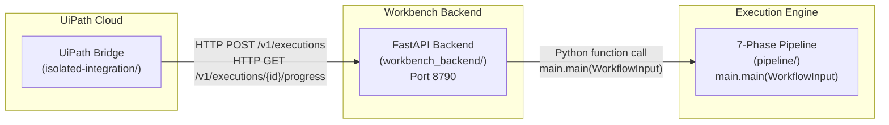

# Architecture

<!-- Modified: 2026-06-29T10:00:00Z -->

## Overview

NextFlow operates as a **three-layer runtime chain** where each layer has a distinct responsibility and communicates through a well-defined protocol. The chain is:

```
UiPath Bridge → Backend → Pipeline
```

The Bridge initiates execution via HTTP, the Backend manages the execution lifecycle, and the Pipeline performs the actual 7-phase workflow processing.

## Architecture Diagram



## Layer Summary

| Layer | Location | Role | Communication Protocol |
|-------|----------|------|----------------------|
| **UiPath Bridge** | `isolated-integration/` | Stateless HTTP router in UiPath Function package. Submits executions and polls for phase progress. | HTTP POST/GET to Backend |
| **Backend** | `workbench_backend/` | FastAPI application (port 8790). Receives HTTP requests, manages execution lifecycle and state machine, calls pipeline. | HTTP (inbound from Bridge), Python function call (outbound to Pipeline) |
| **Pipeline** | `pipeline/` | 7-phase execution engine. Performs the actual workflow processing across phases 0–6. | Python function call: `main.main(WorkflowInput)` |

## Layer Details

### UiPath Bridge (`isolated-integration/`)

The Bridge is a **stateless HTTP router** packaged as a UiPath Function. It runs in UiPath Cloud and acts as the entry point for orchestrated automation workflows.

**Responsibilities:**
- Accept execution requests from UiPath Orchestrator
- Submit execution to the Backend via `POST /v1/executions`
- Poll execution progress via `GET /v1/executions/{id}/progress`
- Report phase progress back to UiPath Orchestrator
- Log execution milestones

**Design constraints:**
- Pure HTTP-based orchestration (HTTP Request, Log Message, Assign, Delay, Gateway)
- No coded-workflow logic or BPMN activities
- Stateless — all state lives in the Backend

---

### Backend (`workbench_backend/`)

The Backend is a **FastAPI application** running on port 8790. It serves as the HTTP adapter and execution lifecycle manager between the Bridge and the Pipeline.

**Responsibilities:**
- Expose RESTful API endpoints for execution management
- Validate incoming requests against the frozen contract
- Manage execution state machine (Received → Validated → Queued → Running → Succeeded/Failed/Cancelled)
- Invoke the Pipeline via Python function call
- Store execution state, logs, and metrics
- Provide health, status, and log retrieval endpoints

**Key endpoints:**
- `POST /v1/executions` — Submit execution (Bridge-compatible)
- `GET /v1/executions/{id}` — Poll status (BridgeOutput format)
- `GET /v1/executions/{id}/progress` — Phase progress (UiPath polling)
- `GET /health` — Health check
- `GET /status/{id}` — Detailed status with phase/progress
- `GET /logs/{id}` — Structured execution log

---

### Pipeline (`pipeline/`)

The Pipeline is the **7-phase execution engine** that performs the actual workflow processing. It is invoked as a Python function call from the Backend.

**Entry point:** `pipeline/main.py:main(WorkflowInput)`

**Phases:**

| Phase | Name | Description |
|-------|------|-------------|
| 0 | `snapshot` | Capture initial state |
| 1 | `scan_analysis` | Analyze and scan input data |
| 2 | `pre_simulation` | Prepare simulation parameters |
| 3 | `simulation` | Execute core simulation logic |
| 4 | `inspection` | Inspect simulation results |
| 5 | `relay` | Relay results to downstream systems |
| 6 | `final_result` | Produce final execution output |

---

## Communication Protocols

### Bridge → Backend (HTTP)

The Bridge communicates with the Backend using standard HTTP:

| Operation | Method | Endpoint | Purpose |
|-----------|--------|----------|---------|
| Submit execution | `POST` | `/v1/executions` | Start a new execution |
| Poll status | `GET` | `/v1/executions/{id}` | Get BridgeOutput-compatible status |
| Poll progress | `GET` | `/v1/executions/{id}/progress` | Get phase-level progress |

### Backend → Pipeline (Python Function Call)

The Backend invokes the Pipeline directly via Python:

```python
from pipeline.main import main as pipeline_main
result = pipeline_main(workflow_input)  # WorkflowInput dataclass
```

No network hop — the Pipeline runs in the same process as the Backend.

---

## State Machine

The execution lifecycle is governed by a state machine defined in `workbench_backend/contract.json`.

### States

| State | Terminal | Cancellable |
|-------|----------|-------------|
| Received | No | No |
| Validated | No | No |
| Queued | No | Yes |
| Running | No | Yes |
| Succeeded | Yes | No |
| Failed | Yes | No |
| Cancelled | Yes | No |

### Transitions

```
Received → Validated → Queued → Running → Succeeded
    ↓          ↓                    ↓          
  Failed     Failed            Failed / Cancelled
                        ↓
                    Cancelled
```

| From State | Valid Next States |
|------------|-----------------|
| Received | Validated, Failed |
| Validated | Queued, Failed |
| Queued | Running, Cancelled |
| Running | Succeeded, Failed, Cancelled |
